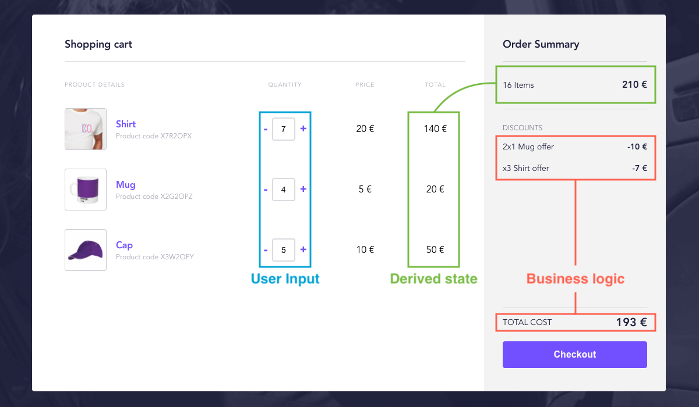
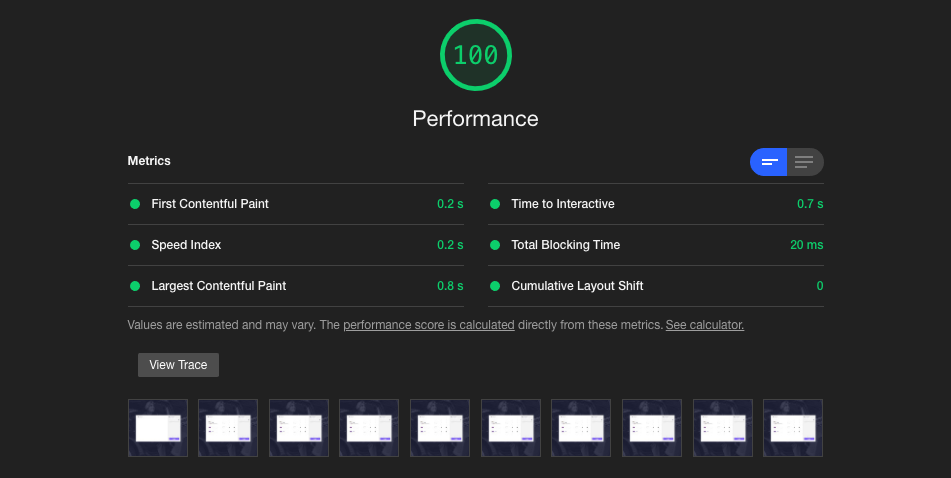
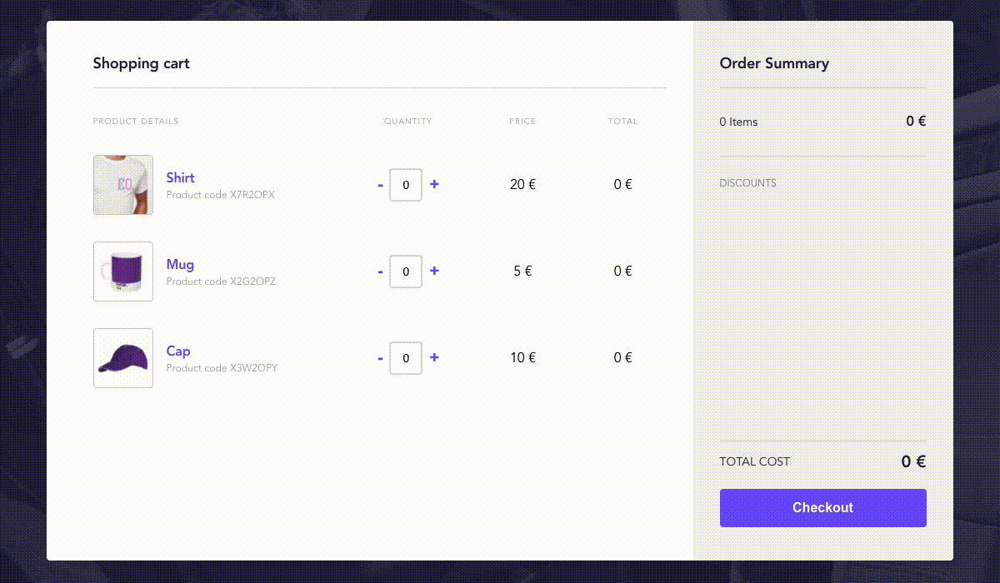

# Cabify Coding Challenge - Shopping Cart

This document attempts to explain the big picture of the code and the architecture it follows, and also give insight about the intentions behind it. Thank you for taking the time to read and review.

## Introduction

To write quality software one has to find the right balance between business needs and mid-to-long term code maintainability. It's everything about understanding the context, not only the technical context but also the product context.

## Product context

The fact that this is a code challenge and not a real product does not mean that there is no context. The description of the exercise highlights three aspects that are considered valuable:

- **Deliver production-ready code:** Which means the code must be reliable, or in other words, it must have tests.
- **Provide a solution that could be easy to grow and easy to add new functionality:** Which means that the code must be easily extensible on the arrival of new business needs, or in other words, maintainable.
- **We value succinctness:** Which means that the product must be simple, or in other words, it must be an MVP that will be useful to validate the business model.

However, these are general considerations. To understand the context we have to focus on the nature of the product, what we know about similar products, and how it will likely evolve in future iterations if it were supposed to suit a real case scenario.

Acting as a product owner, this is what I think is prone to change in a product like this (mini online store):

- The price of the products
- Discount rules

So the priority should go in this direction when it comes to defining the boundaries of the code architecture.

## Technical context

The technical context is more open in this case, this is a greenfield project so there is no legacy code, and the only person involved in the development is me, so the choice of technologies, techniques, etc. will be very opinionated and not open to debate, which would be the healthier thing to do in a real-life situation.

## Technologies of choice

I made my choices taking into account the product needs, striving for fast development to produce maintainable, reliable, and clean code.

- **React:** This is the choice that makes more sense since it is the UI library that I am most proficient on and the one you use at Cabify.

- **Styled-components:** CSS-in-JS is controversial I know, but it is good for fast-paced development, simplifies a lot the building toolset, and helps in writing semantic and understandable code. I think it is ideal for this project since it is small and the drawback of the bundle size will not be noticeable. In a different project with different needs, I would probably use SASS with a BEMIT architecture, I am pretty comfy working this way as well.

> Take a look at the [performance section](#performance) for more information about how I optimized the build to statically serve critical CSS first.

- **Redux with redux-toolkit:** redux-toolkit provides useful defaults like `createReducer` that uses [immer](https://github.com/immerjs/immer) to mutate the state, which leads to cleaner code.


These are the main ones, but I also used others (`redux-saga`, `reselect`, `re-reselect`, etc.) that I will mention as we go.

## Code Comments

You won't find many comments on the code, there are some *quick explanations* about the responsibilities of some parts of the code, but not very in-depth. There are also some *clarifications* about code in this document, especially at the [architecture overview section](#architecture-overview).

In general, I prefer to put my efforts on writing clean code more than in explaining what is the intention of an intricate code.

## Testing

This application is thoroughly tested but I did not use the same methodology for all the parts:

- **Checkout class, reducers, selectors and sagas**: I used TDD for designing these parts because can be easily unit-tested, and actually TDD helps in the design.

- **Components**: I did not use TDD for the components because it does not help with the development process, its more quite the opposite. At the first phase of development components interface is very volatile and writing tests is a nuisance that do not add a lot of value. I try to keep the components as simple as possible, do not write tests from the beginning and when these clearly reach a good maturity point, then I write some integration tests.

## Component organization

The components are organized into three categories:

- **Primitives**: The most atomic building blocks. The components under this category o not contain application-specific logic and they could be potentially extracted into a design system.

- **Partials**: These are build from **primitives** and contain application-specific logic and naming.

- **Views**: Fully functional parts of the application composed by **partials**.

## Architecture overview

This section is divided into three parts: [Checkout class](#checkout-class), [App state](#app-state) and [Checkout and app link](#checkout-and-app-link).

### Checkout class

The Checkout class contains the business logic of the app, it is initialized with the pricing rules that will dictate the final price of the selected products.

> You can find the implementation of the checkout class under the `src/checkout` directory.

#### Pricing rules

Pricing rules are defined as an object containing products and discounts:

```js
const pricingRules = {
    products: [
      {
        id: 'TSHIRT',
        name: 'Shirt',
        code: 'X7R2OPX',
        price: 20.00
      },
      {
        id: 'MUG',
        name: 'Mug',
        code: 'X7R2OPY',
        price: 5.00
      },
      {
        id: 'CAP',
        name: 'Cap',
        code: 'X7R2OPZ',
        price: 10.00
      }
    ],
    discounts: [
      {
        type: 'BUY_1_GET_2',
        name: '2x1 Mug offer',
        options: {
          entitledProductId: 'MUG'
        }
      },
      {
        type: 'BULK_PERCENTAGE',
        name: 'x3 Shirt offer',
        options: {
          entitledProductId: 'TSHIRT',
          percentage: -5,
          minimumSelectionQuantity: 3
        }
      }
    ]
  }
```

The important thing to notice here is that discounts have `type` and `options` properties. Those properties are used to invoke a specific `DiscountRules` class that is created through a `DiscountRulesFactory`.

A code example should shed some light on this:

```js
const discountRules = DiscountRulesFactory.create('BUY_1_GET_2', {
  entitledProductId: 'MUG'
})

console.log(discountRules instanceof DiscountRulesBuy1Get2)
// --> true

// OR

const discountRules = DiscountRulesFactory.create('BULK_PERCENTAGE', {
    entitledProductId: 'TSHIRT',
    percentage: -5,
    minimumSelectionQuantity: 3
  }
})

console.log(discountRules instanceof DiscountRulesBulkPercentage)
// --> true
```

`DiscountRulesBuy1Get2` and `DiscountRulesBulkPercentage` are classes that share a common interface: Both receive a `options` object as the single constructor parameter and have a public method `calculateFor(products)` that calculates the discounted amount from a list of `Product`s.

> This follows the [strategy pattern](https://en.wikipedia.org/wiki/Strategy_pattern), the concrete implementations of `DiscountRules` receive a context (the `options` object) and each follow a different *strategy* to calculate the discounts.

As an example of that interface using the `DiscountRulesBuy1Get2` discount rules:

```js
const mugProduct = new Product({
  id: 'MUG',
  name: 'Mug',
  code: 'X7R2OPY',
  price: 5.00
})

mugProduct.selectedQuantity = 2

const discountAmout = discountRules.calculateFor([
  mugProduct
])

console.log(discountAmout)
// --> -5
```

This pattern is very convenient in this case. Heading back to the [product context section](#product-context), I stated that the discount rules are prone to change, and this architecture will make the code comply with the [open–closed principle](https://en.wikipedia.org/wiki/Open%E2%80%93closed_principle), allowing us to add more discount types only by adding new code, reducing the risk of introducing new bugs in future modifications.

### App state

The app is responsible for handling the user input and updating the state that **can be derived from that input without applying any business logic**. The business logic is instead handled by the checkout class.

Here you can differentiate the parts of the app:



#### Handling user input

The user input is handled by the `Stepper` component that is composed of an input element of type number and two buttons. This will allow the user to increment or decrement the quantity of each product one-by-one by using the buttons, or directly write the desired amount.

> The implementation of the Stepper component can be found in `src/app/components/Stepper.js`

Here is an example of usage:

```js
function Counter () {
  const [value, setValue] = useState(0)

  return (
    <Stepper
      value={value}
      onChange={newValue => setValue(newValue)}
      onDecrease={() => setValue(value - 1)}
      onIncrease={() => setValue(value + 1)}
    />
  )
}
```

There are two important things to notice here:

 - It is a controlled component
 - It does not implement a mechanism to increase or decrease the value, so the decision of how to react to `onDecrease` and `onIncrease` is left to the consumer.

 The reason behind this design is **reusability**, while it is true that this component has a specific behavior in this application, it is potentially useful for another application or even for future features of this one.
 
 The component could implement the increasing/decreasing logic internally and just expose the `onChange` handler that would always provide the updated `newValue`, but this will force us to modify the component when new requirements come.

 Regarding the example above, consider a new requirement from the product owner:

 > The quantity must be increased or decreased in steps of 10 if the user is pressing the shift key while clicking the buttons.

 It is considerably easier to implement: The component does not have to be modified, and less risk is introduced:

 ```js
function Counter () {
  const [value, setValue] = useState(0)
  const isShiftPressed = useKeyPressed('shift')

  const incrementStep = isShiftPressed ? 10 : 1

  return (
    <Stepper
      value={value}
      onChange={newValue => setValue(newValue)}
      onDecrease={() => setValue(value - incrementStep)}
      onIncrease={() => setValue(value + incrementStep)}
    />
  )
}
```

This is an example of the [dependency inversion principle](https://en.wikipedia.org/wiki/Dependency_inversion_principle) applied to react components. Reviewing the principle statement:

> High-level modules should not depend on low-level modules. Both should depend on abstractions (e.g. interfaces).
>
> **From Wikipedia**

The high-level module in our example is the `Counter` and the low-level is the `Stepper`, the first's logic does not depend on the latter, they communicate through an event-based interface.

To conclude, I would like to remark on an implementation detail of the `Stepper`. It uses a custom hook `useControlledInputNumber` to sanitize the input of the user by enforcing numerical values while allowing to edit the value. I thought it could be useful for other people so I extracted it from this codebase and open-sourced it. You can find more details about it [here](https://github.com/d-asensio/use-controlled-input-number).

#### Updating the state

The state of the application is managed with [Redux](https://github.com/reduxjs/redux), as aforementioned in the [technologies of choice section](#technologies-of-choice) it is used in tandem with [redux-toolkit](https://github.com/reduxjs/redux-toolkit) that is intended to be the standard way to write Redux logic.

But this is superficial, the interesting part to explain here is how the state is modeled to describe the information that our application needs to operate:

```js
const state = {
  isLoadingProducts: false,
  productsById: {
    TSHIRT: {
      id: 'TSHIRT',
      name: 'Shirt',
      code: 'X7R2OPX',
      price: 20,
      imageSrc: 'images/products/shirt/main.jpg',
      thumbnailSrc: 'images/products/shirt/thumbnail.png'
    },
    MUG: {
      id: 'MUG',
      name: 'Mug',
      code: 'X2G2OPZ',
      price: 5,
      imageSrc: 'images/products/mug/main.jpg',
      thumbnailSrc: 'images/products/mug/thumbnail.png'
    },
    CAP: {
      id: 'CAP',
      name: 'Cap',
      code: 'X3W2OPY',
      price: 10,
      imageSrc: 'images/products/cap/main.jpg',
      thumbnailSrc: 'images/products/cap/thumbnail.png'
    }
  },
  productCountersById: {
    TSHIRT: 3,
    MUG: 3,
    CAP: 2
  },
  discounts: [
    {
      name: '2x1 Mug offer',
      amount: -5
    },
    {
      name: 'x3 Shirt offer',
      amount: -3
    }
  ],
  grandTotal: 87
}
```

The product information and the counters are separated parts of the state, which is useful because when it comes to update the quantity of a product, the reducer only has to mutate the `productCountersById` object. This makes the code very simple and safer because the `productsById` object remains untouched:

```js
export function updateProductCounter (state, { payload }) {
  const { productCountersById } = state
  const { id, quantity } = payload

  if (quantity < 0) return

  productCountersById[id] = quantity
}
```

Once the state is updated, any subscribed component gets notified and re-renders if necessary to show the new information. But the components do not access the state directly, they use selectors to get the information they need, either if this information is accessible in a direct way or it has to be processed.

This pattern creates a contract between the components and the state, providing flexibility and robustness. It allows to modify components without having to modify the state and vice-versa.

### Checkout and app interaction

I have described the checkout class and the app, but how they link together?

In my opinion, the frontend should be as "dummy" as possible: It should contain the minimum amount of business logic and in case that it is unavoidable, the business logic should be isolated from the presentation layer.

For this reason, I think that the checkout class should not be used directly from the reducers and thus it should be considered as an external service. Just like if we had an API endpoint that we could use to calculate the discounts and the final price of the user selection.

This is not a wild idea and probably, as our little store grows, we will start to have tens of discount rules and this logic will probably be migrated to the backend and exposed through an API.

With this possibility in mind, I have created the checkout service: A [facade](https://en.wikipedia.org/wiki/Facade_pattern) between the application, the checkout class, and the price rules data.

> The implementation of the checkout service can be found in `src/app/services/initCheckoutService.js`

This service can be easily modified to get discounts and total price information from an API endpoint or any other data source that we want without having to modify any other part of the application.

This is an example of how to use it:

```js
const checkoutService = initCheckoutService()

;(async () => {
  const products = await checkoutService.getAvailableProducts()

  console.log(products)
  // -> [{ id: 'MUG', ... }, { id: 'TSHIRT', ... }, ...]

  const selectedProducts = [
    { id: 'MUG', quantity: 3 },
    { id: 'TSHIRT', quantity: 2 }
  ]

  const summary = await checkoutService.getSummaryForSelection(selectedProducts)

  console.log(summary)
  // -> { 
  //   discounts: [{ name: 'x3 Shirt offer', amount: -5 }],
  //   total: 30
  // }
})()
```

> The `initCheckoutService` function uses the [revealing module pattern](https://addyosmani.com/resources/essentialjsdesignpatterns/book/#revealingmodulepatternjavascript) to provide private and public encapsulation by taking advantage of the javascript scope rules.

Once created, the `checkoutService` can be used to get the available products and to calculate the summary given an array with the selected products.

> It is worth mentioning that this service will fetch the data of the products and discounts through the network, but I have not developed an API. I just used the `copy-webpack-plugin` to copy the contents of the `data` folder to the build directory and thus the JSON files that are placed there will be served as part of the bundle.

To update the state with the data returned from the service I used [redux-saga](https://redux-saga.js.org/). Every time that the `updateProductCounter` action is dispatched, a saga is triggered, then the service is requested about the summary information and an action is dispatched to update the state with the new information.

This is done this way because the checkout service could potentially be connected to an external data source so it can not be considered pure, the output can not be determined from the input since the API behavior is opaque from the application point of view.

To make this process efficient, the `checkoutService` memoizes any fetched data so it will only fetch the required data once.

## Performance

These are the optimizations that I made to improve the performance of the app:

### Critical CSS first

Quoting Harry Roberts from his fantastic article [CSS and Network Performance](https://csswizardry.com/2018/11/css-and-network-performance/):

> We need to construct the DOM and CSSOM as quickly as possible

This is important to achieve a good **first meaningful paint** and increase the responsiveness of the application so the user will perceive a faster load.

The best way to do that is to identify all the styles that are needed for the first render and inline them in `<style>` tags in the `<header>` of the document.

Thanks to the nature of [styled-components](https://github.com/styled-components/styled-components) we can use [react-snap](https://github.com/stereobooster/react-snap) to achieve this in a breeze since styled-components already uses the `<style>` tag to output the styles.



### Optimize redux selectors

A selector is a function that receives the entire Redux state and returns a value based on that, normally by applying some operations to the passed state.

This could become a problem if a selector performs an expensive operation because it will execute it every time the state is updated, even if the updated part does not have any effect on the result of the operation.

To overcome this, I used [reselect](https://github.com/reduxjs/reselect). This library memoizes the selectors to avoid redundant executions. But this optimization can be pushed further by using [re-reselect](https://github.com/toomuchdesign/re-reselect) for certain selectors, for example, the `getProductQuantity` selector:

```js

const getProductQuantity = createSelector(
  getProductCountersById,
  (_, productId) => productId,
  (productCountersById, productId) => {
    return productCountersById[productId] || 0
  }
)


const state = {
  productCountersById: {
    TSHIRT: 3,
    MUG: 3,
    CAP: 2
  }
}

const shirtQuantity = getProductQuantity(state, 'TSHIRT')
const mugQuantity = getProductQuantity(state, 'MUG')
const capQuantity = getProductQuantity(state, 'CAP')
```

Since `reselect` memoizes based on the parameters of the selector, the second parameter `productId` invalidates the cache in each call, resulting in redundant operations. In cases like this, I used a `re-reselect` cached selector, that will memoize the result based on a key, which in this case is the `productId`:

```js
const getProductQuantity = createCachedSelector(
  getProductCountersById,
  (_, productId) => productId,
  (productCountersById, productId) => {
    return productCountersById[productId] || 0
  }
)(
  (_, productId) => productId
)
```

Another optimization that worths mention is the case of the `getDiscounts` selector. As stated in the [architecture overview section](#architecture-overview) the discounts are calculated by the checkout class, which is considered an external service. This means that discounts will change every time the service is consulted, even if the result is the same value that was already in the state.

> The implementation of the `getDiscounts` selector can be found in `src/app/selectors/summary.js`

To overcome this, I have used a `createDeepEqualSelector` that compares the discounts objects deeply instead of shallowly. This technique should not be used for parts of the state whose change is predictable, but in this case, it is the best way to optimize this part.

This is the result of the aforementioned optimizations and some others made by the `useSelector` hook that the components are using to get the information they need:



As you can see only the affected parts are re-rendered.

## Future improvements

Here are some improvements that would be beneficial in a real-case scenario:

- **Code splitting**: As the product grows it will be necessary to implement code splitting in order to reduce the initial bundle size and reduce the total blocking time, this becomes specially important when using styled-components. For now though it is not necessary.

- **Nicer animations**: Loading the list, opening and closing dialogs, etc. All the user interactions are so rough. It will be better to add some micro animations to improve the UX.

- **Design tokens**: It would be lovely to agree on some design standards with the design team and create some tokens and utilities for applying color, spacing, typography etc. I think that it really improves maintainability. But I think it should not be done from the beginning, it is better to let the product mature a bit to see the patterns arise.

## Final notes

I like to put all my love in the things I do, and so I did in this small project. I enjoyed it so much and regardless of the result I hope you also enjoyed the review.
